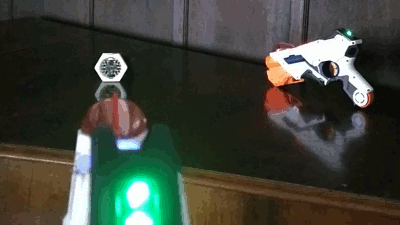

# teamHitColour

Show the colour of the team who's IR signal was last recieved.

Intended as a basic test of receiver function. 

The sketch will need the [IRLib2](https://github.com/cyborg5/IRLib2) adding
to the Arduino libraries folder. Details in the
[library README file](https://github.com/cyborg5/IRLib2/tree/master/IRLib2).
